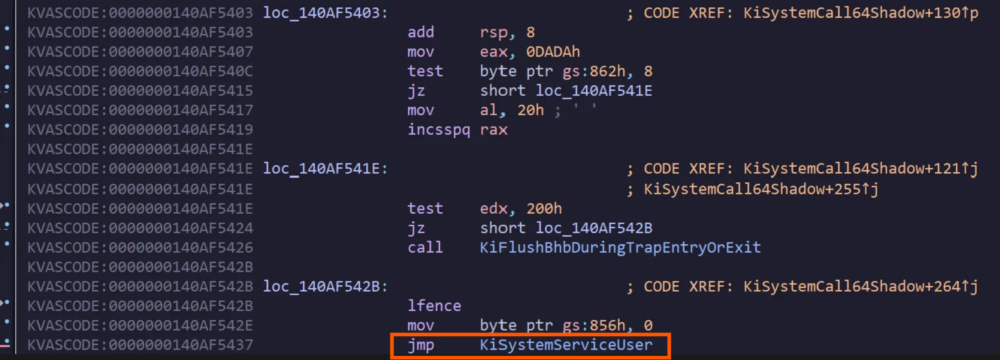

# KeServiceDescriptorTable "Leak"

### Context 

While crafting a kernel driver that intercepts system calls (👀), I realized that I needed at some point the SSDT to resolve the name of intercepted system calls from their ID. The problem is that the Windows kernel no longer exports the ``KeServiceDescriptorTable`` function on its x64 versions for obscure reasons, so it's impossible to obtain its address with  ``MmGetSystemRoutineAddress`` or ``RtlFindExportedRoutineByName``. I therefore looked for a trick to resolve this address in a runtime and universally compatible way with several versions of the kernel. 

I came across the following simple technique, based on a supplied address: ``KiSystemCall64Shadow``, the Meltdown-related system call handler found at MSR ``c000082``.

```
0: kd> rdmsr c0000082
msr[c0000082] = fffff804`4da1a1c0

0: kd> u fffff804`4da1a1c0 L1
nt!KiSystemCall64Shadow:
fffff804`4da1a1c0 0f01f8          swapgs
```

### From KiSystemCall64Shadow to KeServiceDescriptorTable

``KiSystemCall64Shadow`` ends with an unconditional jump to ``nt!KiSystemServiceUser``, which is the only ``jmp`` in the function's opcodes.

```
0: kd> u KiSystemCall64Shadow L80
nt!KiSystemCall64Shadow:
fffff804`4da1a1c0 0f01f8          swapgs
fffff804`4da1a1c3 654889242510900000 mov   qword ptr gs:[9010h],rsp
fffff804`4da1a1cc 65488b242500900000 mov   rsp,qword ptr gs:[9000h]
fffff804`4da1a1d5 650fba24251890000001 bt  dword ptr gs:[9018h],1
{...}
fffff804`4da1a425 e9237e9fff      jmp     nt!KiSystemServiceUser (fffff804`4d41224d)
```

The ``KiSystemServiceUser`` address can thus be resolved by extracting the relative offset from the jmp opcodes ``e9237e9fff`` knowing that the jmp opcode is ``e9``.

This same jump is also performed in Windows 11 23H2 syscall handler:



The relative offset here is ``ff9f7e23``. This is a signed offset, so it must be converted to a positive value: 

```
0: kd> dx -0xff9f7e23,x
-0xff9f7e23,x    : 0xffffffff006081dd
```

We can then pivot on ``KiSystemServiceUser``:

```
0: kd> u fffff804`4da1a425 + 5 - 0x6081dd L1
nt!KiSystemServiceUser:
fffff804`4d41224d c645ab02        mov     byte ptr [rbp-55h],2
```

In C, it would look like something like this:

```c
ULONGLONG LeakKiSystemServiceUser() {

    QWORD KiSystemCall64Shadow = (QWORD)__readmsr(0xC0000082);
    ULONGLONG lastJmpAddr = NULL;

    do {
        __try {

            KiSystemCall64Shadow += 2;
            UINT8 jmp_byte[] = { 0xE9 };

            if (contains_bytes_bitwise(*(PULONG)KiSystemCall64Shadow, jmp_byte, 1)) {
                lastJmpAddr = KiSystemCall64Shadow;
            }
        }
        __except (EXCEPTION_EXECUTE_HANDLER) {
            DbgPrint("[-] Exception\n");
            return NULL;
        }

    } while (*(PULONG)KiSystemCall64Shadow != 0);

    LONG kiSystemServiceUserOffset = -(*(PLONG)(lastJmpAddr + 2));
    ULONGLONG kiSystemServiceUser = (ULONGLONG)((lastJmpAddr + 2 + 4) - (LONG)kiSystemServiceUserOffset);

    return kiSystemServiceUser;
}
```

``KiSystemServiceUser`` exposes various non-exported functions offsets that are relevant, including ``KeServiceDescriptorTable``

```
0: kd> u nt!KiSystemServiceUser L100
nt!KiSystemServiceUser:
{...}
nt!KiSystemServiceRepeat:
fffff803`30c12384 4c8d1535f59e00  lea     r10,[nt!KeServiceDescriptorTable (fffff803`316018c0)]
fffff803`30c1238b 4c8d1daea68e00  lea     r11,[nt!KeServiceDescriptorTableShadow (fffff803`314fca40)]
{...}
```

``4c8dd1`` are the opcodes corresponding to ``lea r10``, what remains is the relative offset to ``KeServiceDescriptorTable``.

```
0: kd> dx *(void**)(0xfffff803`30c12384) >> 24 & 0x00FFFFFFFF
*(void**)(0xfffff803`30c12384) >> 24 & 0x00FFFFFFFF : 0x9ef535
```

We can then use this offset to access the SSDT table.

```
0: kd> dqs fffff803`30c1238b + 0x9ef535
fffff803`316018c0  fffff803`308c7cf0 nt!KiServiceTable
fffff803`316018c8  00000000`00000000
fffff803`316018d0  00000000`000001d9
fffff803`316018d8  fffff803`308c8458 nt!KiArgumentTable
fffff803`316018e0  00000000`00000000
fffff803`316018e8  00000000`00000000
fffff803`316018f0  00000000`00000000
fffff803`316018f8  00000000`00000000
fffff803`31601900  fffff803`312182c0 nt!KiBreakpointTrapShadow
fffff803`31601908  fffff803`31218340 nt!KiOverflowTrapShadow
fffff803`31601910  fffff803`31218d40 nt!KiRaiseSecurityCheckFailureShadow
fffff803`31601918  fffff803`31218dc0 nt!KiRaiseAssertionShadow
fffff803`31601920  fffff803`31218e40 nt!KiDebugServiceTrapShadow
fffff803`31601928  fffff803`3121a1c0 nt!KiSystemCall64Shadow
fffff803`31601930  fffff803`31219e40 nt!KiSystemCall32Shadow
```

Here too, we can represent it as follows (not the most perfect)

```c
ULONGLONG LeakKeServiceDescriptorTable(ULONGLONG kiSystemUser) {

    for (int i = 0; i < 0x1000; i++) {

        __try {

            UINT8 sig_bytes[] = { 0x4C, 0x8D, 0x15 };
            ULONGLONG val = *(PULONGLONG)kiSystemUser;

            if (contains_signature((ULONGLONG)&val, 8, sig_bytes, sizeof(sig_bytes))) {

                ULONG kiSystemServiceRepeatOffset = (*(PLONG)(kiSystemUser + 8));
                ULONGLONG keServiceDescriptorTable = kiSystemUser + 12 + kiSystemServiceRepeatOffset;

                return keServiceDescriptorTable;
            }
            kiSystemUser += 2;
        }
        __except (EXCEPTION_EXECUTE_HANDLER) {
            DbgPrint("[-] Exception\n");
            return NULL;
        }
    }
    return NULL;
}
```

The driver code provided in this repo applies this method + associates **routines that are exported by the kernel** with their Syscall ID:

```
1: kd> ed KD_DEFAULT_MASK 0xFFFFFFFF
1: kd> g
[+] KiSystemServiceUser: FFFFF80330C1224D
[+] KeServiceDescriptorTable: FFFFF803316018C0
[+] NumberOfServices: 473
		[4] - NtWaitForSingleObject - FFFFF80330E32FF0
		[6] - NtReadFile - FFFFF80330DF8520
		[7] - NtDeviceIoControlFile - FFFFF80330E314E0
		[8] - NtWriteFile - FFFFF80330DF77A0
		[13] - NtSetInformationThread - FFFFF80330E303C0
		[14] - NtSetEvent - FFFFF80330EEE970
		[15] - NtClose - FFFFF80330E33140
		[17] - NtQueryInformationFile - FFFFF80330E2F640
		[20] - NtFindAtom - FFFFF80330E549F0

		{...}
```

In the hope that this simple trick will help anyone expressing the need to access the SSDT in runtime mode directly from their driver :)
